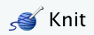
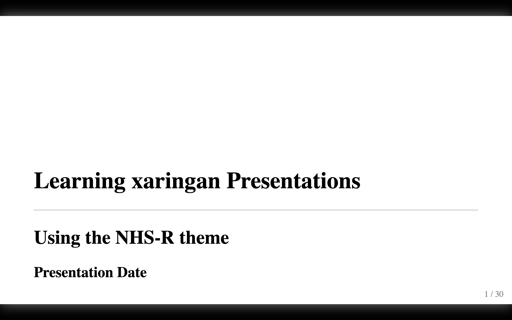
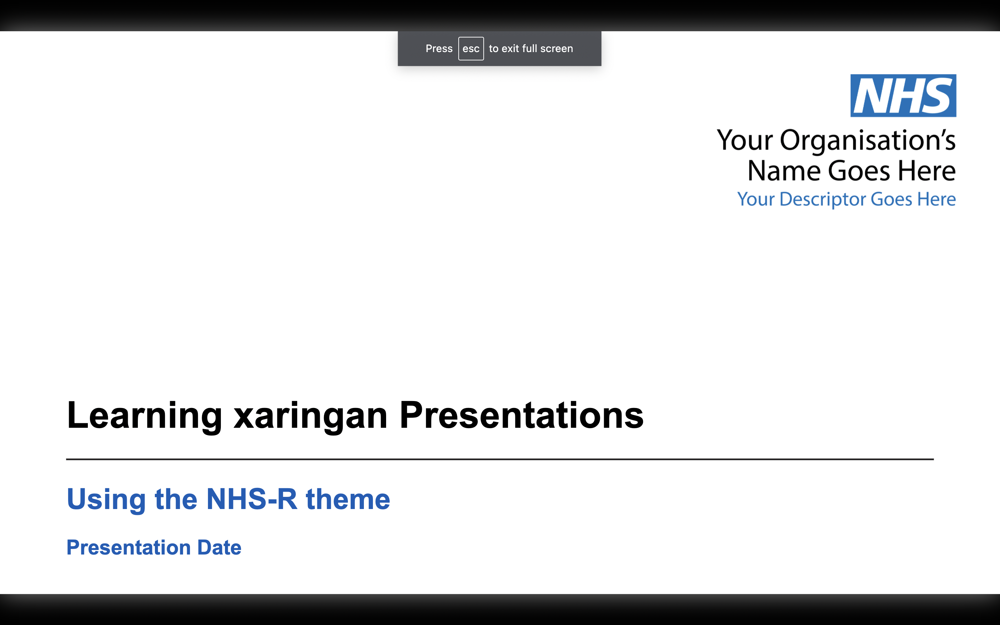

```{r setup, include = FALSE}

# load packages
library(knitr)
library(tidyverse)
library(nhsrtheme)
library(icons)
library(fontawesome)
library(xaringanExtra)

# set default options
opts_chunk$set(echo = FALSE,
               fig.width = 7.252,
               fig.height = 4,
               dpi = 300)

xaringanExtra::use_tile_view()
xaringanExtra::use_panelset()
# uncomment the following lines if you want to use the NHS-R theme colours by default
# scale_fill_continuous <- partial(scale_fill_nhs, discrete = FALSE)
# scale_fill_discrete <- partial(scale_fill_nhs, discrete = TRUE)
# scale_colour_continuous <- partial(scale_colour_nhs, discrete = FALSE)
# scale_colour_discrete <- partial(scale_colour_nhs, discrete = TRUE)
```

class: title-slide, left, bottom

# `r rmarkdown::metadata$title`
----
## **`r rmarkdown::metadata$subtitle`**
### `r rmarkdown::metadata$author`
### `r rmarkdown::metadata$date`

---
class: inverse, middle, center

# An inverse slide

Often used for transitions

---

# Where did I pull this from:

--

* These slides are created using the package [xaringan](https://github.com/yihui/xaringan)
  - Documentation in slide form can be found [here](https://slides.yihui.org/xaringan/#1) 
  - Documentation in book form can be found in Chapter 7 of the [RMarkdown book](https://bookdown.org/yihui/rmarkdown/xaringan.html)

* This is using the NHS-R theme. Other xaringan themes can be seen [here](https://github.com/yihui/xaringan/wiki/Themes)  
  - Visit the website [here](https://spcanelon.github.io/xaringan-basics-and-beyond/index.html)
  - At the above link, they provide a two-day intro to xaringan using their template:
     * Day 1 slides and video
     * Day 2 slides and video

* I will be working through these and summarizing what I've learned here.

---

# The Rmd file

* To begin, start a new RProject (this will make life easier if you want to deploy your slides to github). If you forget to do this, you can always follow the steps [here](https://community.rstudio.com/t/creating-a-new-rproject-from-already-saved-files-rmd-md-scripts/14455)

* Next create a presentation from a template using:
> `File -> New File -> R Markdown -> From Template -> <`_name of template_`>`.

* This will create a R markdown file that begins with a YAML containing some meta data 

* You can convert your `.Rmd` file to `html` slides by either:
1. _knitting_ the document by clicking the  button or on your keyboard using or `Shift` + `Command` + `K`
2. using the moon reader addin. (Go to the `Addins` dropdown menu at the top of the RStudio window and select `Infinite Moon Reader`) 

* I prefer to use the second option since it allows you to view the slides in the Viewer panel (i.e. within the RStudio window as opposed to a separate pop-up window) and it automatically generates the slides as you type! (i.e. bypassing the need to knit to see your changes)

* Your Rmd file will begin with a YAML, followed by an R setup chunk.


---

# YAML

My YAML looks like this.  You can change the meta data to what is appropriate.

```yaml
---
title: "Xaringan Slides"
subtitle: "Using the NHS-R theme"
author: "not me"
institute: "NHS Organisation"
date: "Presentation Date"
output:
  xaringan::moon_reader:
    css: 
      - default
      - css/nhsr.css
      - css/nhsr-fonts.css
    lib_dir: libs
    seal: false
    nature:
      highlightStyle: googlecode
      highlightLines: true
      highlightLanguage: ["r"]
      countIncrementalSlides: false
      ratio: "16:9"
    includes:
      after_body: [css/insert-logo.html]
---
```

---

# Slides

* Notice that slide content starts immediately after the YAML (i.e it will be missing the `---` in this case)

--

* The first slide was a title page that was population using the meta-data from our YAML
 - eg `rmarkdown::metadata$title` gives our title: "`r rmarkdown::metadata$title`"
 - `----` created a horizontal line

--

* A new slide begins with  `---`,  pauses created using `--`. N.B, you can't use this within `.pull-left`/`.pull-right`.

--

* Presenter notes can be created using `???`

* This will only be viewable to the presenter in presenter mode
  - presenter mode can be accessed by pressing `p` (press `p` to exit)
  - presenter notes also support markdown
  - the notes should
  - `h` will show you a help menu of useful keyboard shortcuts (again press `h` to exit)
  - for example presenter notes might look like this:

```
???

Only i can see this in presenter mode. **Remember** to _smile_! 
```

???

Can you see this?
_no you can't_
** but i can ** 


---

# Alignment 
* Classes:
  - `title-slide` for titles
  - `inverse` for dark background, light font

--

* Alignment:
  - Vertical alignment: `left`, `middle`, `right`
  - Horizontal alignment: `bottom`, `center`, `top`, 

* You can align certain text using:
  - for example `.right[`_text goes here_`]`  .right[text goes here]
  
  

---

class: top, left
# top _left_ Alignment 

---

class: top, center
# top _center_ Alignment 

---

class: top, right
# top _right_ Alignment 

---

class: middle, left
# Middle _Left_ Alignment 

---

class: middle, center
# Middle _Center_ Alignment 

---

class: middle, right
# Middle _Right_ Alignment 

---

class: bottom, left
# Bottom _Left_ Alignment 

---

class: bottom, center
# Bottom _Center_ Alignment 

---

class: bottom, right
# Bottom _Right_ Alignment 

---

# Placement 

You can layout content to the left or right use the syntax `.pull-left[]` and `.pull-right[]`, respectively.

.pull-left[
Lorem ipsum dolor sit amet, consectetur adipiscing elit, sed do eiusmod tempor incididunt ut labore et dolore magna aliqua. Ut enim ad minim veniam, quis nostrud exercitation ullamco laboris nisi ut aliquip ex ea commodo consequat. Duis aute irure dolor in reprehenderit in voluptate velit esse cillum dolore eu fugiat nulla pariatur. Excepteur sint occaecat cupidatat non proident, sunt in culpa qui officia deserunt mollit anim id est laborum.
]

.pull-right[
Enim neque volutpat ac tincidunt vitae semper quis lectus. Ipsum a arcu cursus vitae congue mauris rhoncus. Sed tempus urna et pharetra pharetra massa massa ultricies mi. Ultrices gravida dictum fusce ut placerat orci nulla pellentesque. Tincidunt vitae semper quis lectus nulla. Vestibulum lorem sed risus ultricies tristique nulla. Eget gravida cum sociis natoque penatibus. Ipsum dolor sit amet consectetur adipiscing elit ut aliquam. A pellentesque sit amet porttitor eget dolor. Mi sit amet mauris commodo quis imperdiet massa tincidunt.

Malesuada nunc vel risus commodo. Rutrum quisque non tellus orci ac auctor augue mauris augue. At consectetur lorem donec massa sapien faucibus et molestie ac. Velit aliquet sagittis id consectetur purus ut faucibus pulvinar. Arcu bibendum at varius vel pharetra 

]

They don't have to take up the entire slide.  See how this can go back to taking up the entire width?

---

# columns within columns! 
.pull-left[

.pull-left[
# Col 1
this is a `.pull-left` within a `.pull-left`

]

.pull-right[
# col 2
this is a `.pull-right` within a `.pull-left`
]

]

.pull-right[

.pull-left[
# Col 1
this is a `.pull-left` within a `.pull-right`
]

.pull-right[
# col 2
this is a `.pull-right` within a `.pull-right`
]
]


###  How sweet it is to be columned by xargingan! (to be columned by xargingan) 

Malesuada nunc vel risus commodo. Rutrum quisque non tellus orci ac auctor augue mauris augue. At consectetur lorem donec massa sapien faucibus et molestie ac. Velit aliquet sagittis id consectetur purus ut faucibus pulvinar. Arcu bibendum at varius vel pharetra 


---

# xarigan columns 

.left-column[
## Left
The left column is 20% slide-width and lighter colour. This panel is created using the syntax `.left-column`. ]

.right-column[
## Right
The right column is 75% textwidth and uses regular font. Notice how the Left and Right columns are not aligned at the top.  This is intentional. I'm guessing this is because the left columns are meant for "Asides" or "Tips" or "Warnings", etc. like the things of that nature that appear in textbooks.
]

Note that unlike before these columns are meant to be used for the entire slide.  As you can see here, if I continue typing we have some weird functionality. For instance, the start of this paragraph gets pushed to the top of the side. Also, now that we have space for the text to run the entire width of the slide, it is not expanding to do so. .red[please avoid this functionality].

* In case you wer wondering, the red text was created using `.red[]`


---

# Images

* you can add images using Rmarkdown (scale depends on image size and it's not very customizable)

> ``

* Using knitr (options [here](https://www.rdocumentation.org/packages/knitr/versions/1.30/topics/include_graphics))

```{r echo=TRUE, eval=FALSE}
knitr::include_graphics("img/camera-green.jpg")
```


* Using HTML (syntax [here](https://www.w3schools.com/html/html_images.asp))

```{r echo=TRUE, eval=FALSE}

```

.footnote[Some sites for free images include: [upsplash.com](upsplash.com),[rawpixel.com](rawpixel.com), [https://www.pexels.com/](https://www.pexels.com/). Ps footnotes are created using `.footnote[]`  ]


---

# Backgrounds

* You can specify a background image (or multiple images) at the start of your slide.  For example:
```
class: title-slide, right, top
background-image: url(img/pathToImage.png), url(www.linkToImage.com)
background-position: 90% 75%, 75% 75%
background-size: 8%, cover
```

* Options for `background-size` include:
  - `cover` will cover the slide so that there is no white space (may cut tops/sides)
  - `contain` fits to slide height-wise
  
* See [here](https://css-tricks.com/almanac/properties/b/background-position/) on how you can play around with background position.

---

# Icons

* Who doesn't love an emoji? Download Hadley Wickhams `emo` package [here](https://github.com/hadley/emo)
  - ` r emo::ji("face")` =  `r emo::ji("face")` $^{1}$
  - ` r emo::ji("poop")` = `r emo::ji("poop")`

.footnote[ _no math in footnotes?_ $^{1}$ the above inline R code was not rendered because I added a space in between the backtick and the r.]  

You can also use [Font Awesome](https://fontawesome.com/) icons: 
- Using HTML: `<i class="fas fa-brain"></i>` doesn't work for me and neither does 
- Using the `icons` [library](https://github.com/mitchelloharawild/icons)
  + `icons::fontawesome("rocket", style = "solid")` = `r icons::fontawesome("rocket", style = "solid")` 
  + `icons::fontawesome$solid$rocket` = `r icons::fontawesome$solid$rocket`
  -   ` r icons::fontawesome("orcid")` = `r icons::fontawesome("orcid")`

- Using `fa()` from the `fontawesome` package:
  -  ` r fa("r-project", fill = "steelblue")` =  `r fa("r-project", fill = "steelblue")`
  
  
---
class: inverse, middle, center

# R content (tables and plots)


---

Of course you could display tables in an R chunk 
```{r}
head(iris)
```
Or using `kable` from the **knitr** package. You can specify several features including:
- `format`: `pipe` (default), `latex`, `simple`, `html`, `rst`
  - `pipe` and `simple` are the most portable.
- `align`:  `l` (left), `c` (center), and `r` (right) 
  - either vector (eg. `c('l', 'c', )`) or single string (eg. `'lc'`)
---
```{r  echo=TRUE}
kable(head(iris), format = "pipe", # this is the default
 digits = getOption("digits"), row.names = NA, align = 'lrcr',
  col.names = gsub("[.]", " ", names(iris)),  caption = "kable Table")
```

---
# Interactive Slides

This is an interactive table but didn't work in this presentation for some reason
```{r  echo=TRUE, eval=FALSE}
library(DT)
kable(DT::datatable(iris))
```
Interactive plots can be created using the  **leaflet** package.  

.red[For the time being you can **not** embed shiny apps within xaringan slides]

Look out for xaringan "widgets" that are still under development. 


---
## This is cool and probably really useful for class:
.pull-left[
### Code

----

```{r irisplot, echo=TRUE, fig.show='hide'}
plot(iris[,1:2], 
     col=iris$Species, 
     pch=as.numeric(iris$Species)+17)
```
The plot created on the right hand side did *NOT* repeat the code above.  Rather it referenced the code chunk by name:
- Chunk 1: 
 
 `{r irisplot, echo=TRUE, fig.show='hide'}`
 
- Chunk 2:
 
 `{r, ref.label="irisplot", echo=TRUE}`
 
]

.pull-right[

### Plot

----


```{r, ref.label="irisplot", fig.height=6}
```

]

---
class: middle
# Code highlighting

if you want to draw attention to some particular line of code you can use highlight in gray by proceeding the line of code with `#<<`.  For example, in the R chunk, line 3 actually is written as `z = x + y #<< `
```{r echo=TRUE}
x <- 4
y <- 10
z = x + y #<<
```

---
# Diployment of Slides

One method of sharing your slides is to deploy them through GitHub pages. Here's how to do it:
1. Ensure your slides are contained within an R project. To [create a new R project from existing files](https://community.rstudio.com/t/creating-a-new-rproject-from-already-saved-files-rmd-md-scripts/14455) select the directory that contains your (isolated) files using:  `File` > `New Project` > `Existing Directory` 

2. Create a new GitHub (Public) repo *without* initializing. (I think we probably could have initialized with a readme)

3.  Make the R project a Git repo by following the instructions in [Ch 17.2](https://happygitwithr.com/existing-github-last.html#make-or-verify-a-git-repo) of  [Happy Git with R](https://happygitwithr.com/):
  <!-- - Use the call `usethis::use_git()` (which requires the *usethis* package) -->
  <!-- - In RStudio, go to  `Tools` > `Project Options` ...> `Git/SVN`. -->
  <!-- Under _Version control system_, select _Git_. Answer "Yes" to "Confirm New Git Repository?" -->
  <!-- - Open Terminal and type `git init` from within in Project's directory. -->
  <!-- - Restart RStudio you should now have a Git pane. -->

4. Connect local repo to git hub repo:
```
git init
git add .
git commit -m "Initial commit"
git remote add origin https://github.com/username/repo-name.git
git push --set-upstream origin master
```

---

# Missing CSS

Note that if you only add the hmtl and Rmd file (i.e css files missing) the slides will not be formated properly.




---

5. Enable GitHub pages:
  - Go to the Github repo
  - Click on the Settings tab
  - Scroll down to where it says: *Source* _GitHub Pages is currently disabled. Select a source below to enable GitHub Pages for this repository_ and Toggle from "None" to "master"
  - Click save. Now your link is ready to share!
  
---

* You have to tweak your url.  

* For instance, mine slides are housed here:

> https://vrbiki.github.io/learning-xaringan/

* But to view it, change it by adding the path to the end of the above: 

> https://vrbiki.github.io/learning-xaringan/NHSRxaringan.html
  
 * An alternative to the above is using the copy and paste solution presented in [Ch 16](https://happygitwithr.com/existing-github-first.html) of Happy Git with R by Jenny Bryan et al.
 
---
class: inverse, middle, center
 
 # How to zhuzh it up 
 ## (Day 2 of [Sharing Your Work with xaringan](https://spcanelon.github.io/xaringan-basics-and-beyond/index.html))
 
 
---
# Overview mode

- As we have seen before, xaringan offers some helpful keyboard shortcut `p` for presenter mode.

- Another helpful shortcut is to press `o` to see an overview of the presentation which creates a thumbnail grid of presentation which you can easily scroll and navigate through.

- To gain access to this feature you need to the run the following in your setup chunk
```{r echo=TRUE, eval=FALSE}
library(xaringanExtra)
xaringanExtra::use_tile_view()
```

- To use tabs in the slides (called "panel set"), put the following into your setup chunk
```{r echo=TRUE, eval=FALSE}
xaringanExtra::use_panelset()
```

---
# Panel set example

.panelset[
.panel[.panel-name[Tab 1]
This is the first panel.  Note that you can use the same kind of stuff you used on regular slides...

.pull-left[
### Left 
----
Pull left for example
- bullet points
- figures (shown on the right)
```{r echo=TRUE}
# some code
x <- 1
x + 4
```

]
.pull-right[
### Right
----


```{r}

```

]
] <!--  end of panel 1 -->

.panel[.panel-name[Tab 2]
this is the second panel
] <!--  end of panel 2 -->


.panel[.panel-name[Tab 3]
this is the third panel 

.pull-left[
### Left
Note that you can use classes within classes.  For instance, you can use `pull-left` within a `.panel`. Cool huh?
]
.pull-right[
### Right
For completion lets put some stuff on the right so you can see how this looks
]


] <!--  end of panel 3 -->


] <!--  end of panel -->


---
class: inverse, middle, center

# Tweaking the CSS files

---
# CCS (Cascading styling sheet) 
.footnote[ Check out [w3schools what is css](https://www.w3schools.com/whatis/whatis_css.asp)]

* Inside the *lib* > *remark-css* folder there is a file called `default.css` (CSS stands for cascading styling sheet)

* This acts as a template for whats gets used in a standard xaringan styling sheet.

* Styling rules are created using _selectors_.  

* Each selector has one or more _properites_ that are assigned a value.

The general structure is shown below (for more see [this complete guide to css functions](https://css-tricks.com/complete-guide-to-css-functions/))

```
.selector{
     property: function("argument"); # <-- declaration
}
```

* For more on properties and selectors please visit [https://css-tricks.com/almanac/](https://css-tricks.com/almanac/)

See more info on which css files are being used on the help page `?xaringan::moon_reader`
---

# Class selectors

* _Class selectors_ begin with a period.  For example, the follow rule selects all level 1 headers (as denoted using `#`<text> in Rmd) and styles them blue with 12px font size.
```
h1 {color:blue; font-size:12px;}
```
More generically we might have:
```
selector {property:value; property2:value}
```
Another example, for `#>>` highlight code will appear in yellow in the default cs..
```
.remark-code-line-highlighted { background-color: #ffff88; }
```
In the NHSR css file, they change that so highlighted code has a gray background:
```
.remark-code-line-highlighted { background-color:   #E8EDEE;}
```

---
More Class Selector examples:

```
/*-- CUSTOM CLASSES FOR TEXT EMPHASIS --*/
.blue       { color:   #005EB8 }
.green      { color:   #009639 }
.pink       { color:   #AE2573 }
.red        { color:   #DA291C }
.warmyellow { color:   #FFB81C }
```
To use them within your Rmd file type, for example,
```
.pink[this is how you use them]
```
Which renders too...

> .pink[this is how you use them]

You can make css styles direcly in your Rmd file in a code chunk! (just change the chunk from {r} to {css}. Eg, 
.pull-left[
```
.fade { 
  opacity: 0.5; 
}
```
]

.pull-right[
```{css}
.fade { 
  opacity: 0.5; 
}
```
```
.fade[what does this do?]
```
> .fade[what does this do?]
]

---

# Colors and fonts.

Some links for making colour palettes include:
- [https://coolors.co/](https://coolors.co/) (see trending ones [https://coolors.co/palettes/trending](https://coolors.co/palettes/trending))
- [https://mycolor.space/](https://mycolor.space/)
- [https://www.color-hex.com/](https://www.color-hex.com/) (to look up hex codes)


You can change your fonts in the font.css file.

[https://fonts.google.com/](https://fonts.google.com/) to look up some fonts. Once you find a font you like from that site, click "+ Select this style" which ones a panel on the right. 
- Select "@import".
- Copy and paste the text between the `<style>` tags
- paste it inside your font.css file


---
# Fonts

Here is how the NHSR css file does it (in *css* folder. filename: *nhsr-fonts.css*)

```
@import url('https://fonts.googleapis.com/css2?family=Roboto+Mono:wght@300;400&display=swap');
body { font-family: "Arial", "Frutiger", sans-serif; }
h1, h2, h3 { font-family: "Frutiger", "Arial", sans-serif;}
```
Multiple fonts are used as backup. For example, in the header selectors, if the users do not have the font "Frutiger" than the user to instead see the headers in "Arial" font.

(from [Ninja](https://slides.yihui.org/xaringan/#1) slides):
- If you used Google fonts in slides they won't work offline unless you download or install them locally.  
- The Heroku app [google-webfonts-helper](https://google-webfonts-helper.herokuapp.com/fonts) can help you download fonts and generate the necessary CSS.
- Seting the css option in the YAML metadata:
```{r echo=TRUE, eval=FALSE}
output:
  xaringan::moon_reader:
    css: ["default", "ubuntu-mono.css"]

```
 assumes  `ubuntu-mono.css` is under the same directory as your Rmd.

---
# Themes 

- A theme typically consists of two CSS files `foo.css` and `foo-fonts.css`, where `foo` is the theme name.

- Below are some existing themes:
```{r echo=TRUE}
names(xaringan:::list_css())
```

.footnote[From Ninja slides]
---
# Themes

To use a theme, you can specify the css option as an array of CSS filenames (without the .css extensions), e.g.,
```{r eval=FALSE, echo=TRUE}
output:
  xaringan::moon_reader:
    css: [default, metropolis, metropolis-fonts]

```

    
.footnote[From Ninja slides]
---
# how do we specify which CSS to use

In the YAML. If you go to the top of this Rmd file for example, you'll see:
```
output:
  xaringan::moon_reader:
    css: 
      - default
      - css/nhsr.css
      - css/nhsr-fonts.css

```
---
class: inverse, middle, center

# Ninja Presentation
##Information extracted from the [Ninja](https://slides.yihui.org/xaringan/#1) default slides

---
# Math Expressions

Which latex syntax works, for example this inline expression $f(x) = {n \choose x} (p)^x (1-p)^{n-x}$ or this "math mode" equations: $$ f(x) = {n \choose x} (p)^x (1-p)^{n-x} $$ you must make sure that:
- inline Latex math code is restricted to one (rendered) line
- math mode (which begins and ends with double dollar signs `$$`)
- Apparently _the starting `$$` must appear in the very beginning of a line, followed immediately by a non-space character, and the ending `$$` must be at the end of a line, led by a non-space character;_ but I did not follow that rule above and it rendered just fine.

---
# Note

- Shiny apps cannot (and should not?) be embedded in slide deck, i.e. the Shiny mode (`runtime: shiny`) does not work.  Yuiwei suggest launching them separately.

- You can add a countdown timer to your slides. The following will display a timer beside the page number counting down from 01:00. Once it reaches 0:00 it will start counting up (but now, in red font).
```{r eval=FALSE, echo=TRUE}
output:
  xaringan::moon_reader:
    nature:
      countdown: 60000
```

* The following code will be highlight if `highlightLines: true`. 
  - lines that start with `*`, (this option may cause errors if you actually have to run the code)
  - lines wrapped in `{{ }}`
  - lines trailing comments `#<<`
```{r eval=FALSE, echo=TRUE}
output:
  xaringan::moon_reader:
    nature:
      highlightLines: true
```

---
# code output highlighting

- To high light code *output* use, `highlight.output = true` in the code chunk.  
- If you only want certain lines of output code to be highlighted use, for example, 
`highlight.output = c(1, 3) `.  For example:
```{r, highlight.output=c(1, 3), echo=TRUE}
head(iris, 4)
```

Cool trick for even/odd highlighting `highlight.output=c(TRUE, FALSE)`
```{r, highlight.output=c(TRUE, FALSE)}
head(iris)
```


---
# Title Slides

- Rather than adjusting the CSS file, you could adjust the title slide position of test in the YAML :
```{r eval=FALSE, echo=TRUE}
output:
  xaringan::moon_reader:
    nature:
      titleSlideClass: [top, left, inverse]
```
To disable the title side use:
```{r eval=FALSE, echo=TRUE}
output:
  xaringan::moon_reader:
    seal: false
```

---
# Tips

- Slides will not work offline unless you have a local copy of *remark.js*

- To get this run `xaringan::summon_remark()` and change the chakra in the YAML:
```{r echo=TRUE, eval=FALSE}
output:
  xaringan::moon_reader:
    chakra: libs/remark-latest.min.js
```
(by default RStudio uses an online version)

---
# Macros

- *remark.js* allows users to define custom macros (JS functions).

- They can be applied to Markdown text using either
> `![:macroName arg1, arg2, ...]` or 
> ``

- For example, before remark.js initializes the slides, you can define a macro named `scale`:
```
remark.macros.scale = function (percentage) {
  var url = this;
  return '';
};
```
.red[It is not clear to me where this goes (* nvm see next slide.)]
Then the Markdown text
```

```
will be translated to
```

```
---
# Macros (contd)


- To insert macros in xaringan slides, you can use the option `beforeInit` under the option `nature`, e.g.,
```{r echo=TRUE, eval=FALSE}
output:
  xaringan::moon_reader:
    nature:
      beforeInit: "macros.js"
```

You save your remark.js macros in the file `macros.js`.

- The `beforeInit` option can be used to insert arbitrary JS code before `remark.create()`. Inserting macros is just one of its possible applications. .red[not sure what this means]


# Quotes

```{r}
library(tufte)
```

> "If it weren't for my lawyer, I'd still be in prison.
>  It went a lot faster with two people digging."
>
> `r tufte::quote_footer('--- Joe Martin')`
